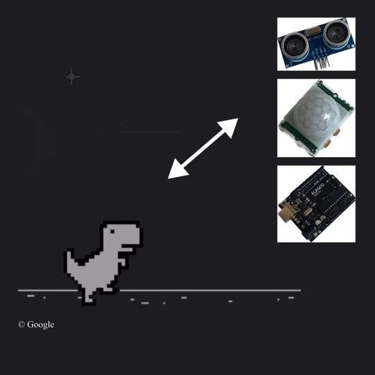

# Jump & Adventure

## Overview

Inspired by the Google Chrome Dinosaur Game, an obstacle-avoidance game where users control a "dinosaur" by clicking a mouse or keyboard, **Jump & Adventure** reimagines the game with more engaging and interactive controls. Our system replaces the traditional clicking mechanics with wearable and sensor-based interactions to enhance the user experience.

By combining **Arduino** and **P5.js** technologies, our game integrates:
1. A **wearable component** that detects users' jumping motions to control the game.
2. A **gesture-based sensor** that allows users to start, pause, and resume the game with simple hand movements.

## Goals

The primary goal of this project is to evaluate the usability of various interaction types in a clicking-based game environment. By experimenting with multiple sensor technologies, we aim to determine which interaction methods are most suitable and enjoyable for this genre.

## Features
- **Jump Detection**: A wearable device interprets jumping motions to control the "dinosaur" in-game, making gameplay more physically engaging.
- **Gesture Control**: Sensors enable seamless game controls such as starting, pausing, and resuming the game through hand gestures.
- **Technology Integration**: Built using Arduino for hardware interaction and P5.js for game implementation and visualization.

## Technology Stack
- **Arduino**: For interfacing with sensors and wearable devices.
- **P5.js**: A JavaScript library used for creating the game environment and visuals.
- **Sensors**: Includes a combination of motion and proximity sensors to capture user actions.

## How to Run the Project
1. Clone this repository and ensure you have the necessary hardware setup.
2. Connect the Arduino to your system and upload the provided code to the board.
3. Run the P5.js script in a local web server to start the game.
4. Interact with the game using jumping motions and hand gestures as described above.

## Future Work
We plan to further refine and test the interaction models by:
- Incorporating more advanced sensors for better motion detection.
- Extending usability testing to gather feedback from a broader audience.
- Exploring additional gesture types to enhance gameplay diversity.

## Acknowledgments
This project was developed by a dedicated team passionate about combining technology with fun and innovative gaming experiences. Special thanks to the creators of the Google Chrome Dinosaur Game for inspiring this project!
